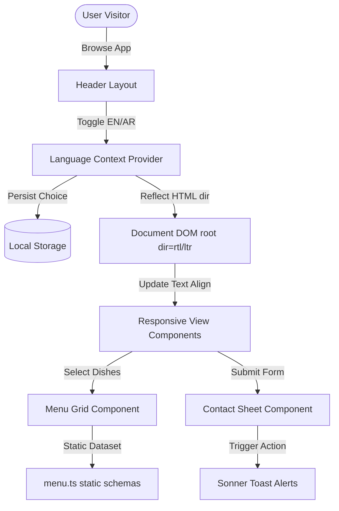

# 🍽️ Damascus Restaurant (Layali Shami) - Premium Food Landing & Ordering UI

<div align="center">
  
</div>

Layali Shami (Damascus Restaurant) is a high-fidelity, interactive, and responsive web frontend landing page and ordering interface. Reverse-engineered to model premium design details, this application showcases modern CSS transitions, multi-language internationalization (English & Arabic with full RTL support), elegant typography, and a Levantine aesthetic.

---

## 🚀 Key Features

* **🌐 Dual-Language Internationalization (i18n)**: Instant English and Arabic toggle built on a custom `LanguageContext` that automatically triggers `<html dir="rtl">` layout shifts and persists choices in `localStorage`.
* **🎨 Elegant Levant Design System**: Custom design tokens including warm text gradients (`.text-gradient-warm`), elegant cards (`.card-elegant`), and decorative separators (`<OrnamentDivider />`) modeling traditional Levantine patterns.
* **📱 High-Fidelity Ordering Flow**: Responsive menu layout categories with animated item grids, smooth filters, opening hours widgets, and instant interactive contact sheets.
* **⚡ Modern Performance Stack**: Lightning-fast builds utilizing `Vite`, strict typings with `TypeScript`, layout utilities from `Tailwind CSS`, and pre-configured TanStack Query (`@tanstack/react-query`) for API scalability.
* **🔔 Smart Notifications**: Sleek user alert updates powered by `sonner` for form submissions, menu actions, and setting modifications.

---

## 🧬 Architecture & Logic Flow

Below is the conceptual layout design and internationalization flow of Layali Shami:



---

## 🛠️ Technology Stack & Badges

### Core Frontend Stack
[](https://react.dev/)
[](https://www.typescriptlang.org/)
[](https://vite.dev/)
[](https://tailwindcss.com/)

### UI Features
[](https://reactrouter.com/)
[](https://tanstack.com/query)
[](https://sonner.dev/)

---

## 📂 Folder Structure

```text
damascus-restaurant/
├── index.html         # HTML SPA Entrypoint
├── vite.config.ts     # Build configurations & module mappings
├── tailwind.config.ts # Custom theme palettes, gradients, and typography
├── src/
│   ├── main.tsx       # Entry mount point
│   ├── App.tsx        # Router mapping & layout structures
│   ├── index.css      # Core Tailwind directives, Levantine background patterns, HSL variables
│   ├── assets/        # Visual icons & branding images
│   ├── components/    # Reusable structural components
│   │   ├── layout/    # Header & Footer components (incorporating language selectors)
│   │   ├── home/      # Hero banners, MenuCategoriesGrid, CategoryCard, OpeningHoursCard
│   │   ├── shared/    # Reusable SVG Ornament dividers
│   │   └── ui/        # Custom base inputs & buttons (shadcn styling)
│   ├── context/       # LanguageContext (management of EN/AR toggle & RTL alignment)
│   ├── data/          # static menu datasets (menu.ts details)
│   ├── lib/           # Tailwind class merge helper (cn helper)
│   ├── pages/         # Screen views (Index, Menu page, Contact form, NotFound error)
│   └── types/         # Dish categories and form models
```

---

## 🚀 Getting Started

### Prerequisites
- Node.js (v18.0.0 or higher)
- npm (v9.0.0 or higher)

### Setup & Launch
1. Navigate to the project directory:
   ```bash
   cd damascus-restaurant
   ```
2. Install dependencies:
   ```bash
   npm install
   ```
3. Run the development server:
   ```bash
   npm run dev
   ```
   Open `http://localhost:8080` in your web browser.
4. Build the application for production:
   ```bash
   npm run build
   ```
   npm run preview
   ```

---

## 📜 Verified Certificates & Achievements
To review verified technical accomplishments, backend training, and professional project portfolios, click below:

[](https://herzallah.me#certifications)

---

## 👨‍💻 Developed By
**Sayed Herzallah**  
*Backend-Focused Full-Stack Developer*  
- [LinkedIn Profile](https://www.linkedin.com/in/sayed-herzallah)  
- [Portfolio Website](https://herzallah.me)  
- [GitHub Profile](https://github.com/Sayed-Herzallah)  
