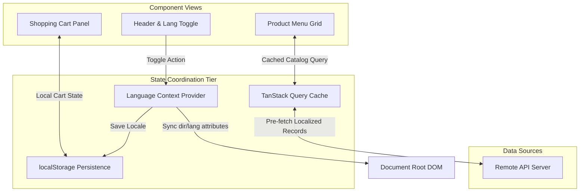

# LayaliShami: Multilingual Order Orchestration Portal

<div align="center">
  
</div>

LayaliShami is a premium, localized ordering and checkout portal client. Built with React, TypeScript, and Tailwind CSS, it models high-performance internationalization flows (Arabic RTL / English LTR) and provides responsive order assembly workflows.

---

## ⚡ The Engineering Challenge

### Problem
Modern multilingual web client applications suffer from layout shift anomalies and caching latency during language switching:
1. **Dynamic Layout shifts (LTR ➔ RTL)**: Modifying display configurations on-the-fly causes sudden visual reflows (FOUC), degrading visual quality.
2. **Translation State Flickering**: Delays between client state switches and content catalog rendering leave the page in an inconsistent hybrid language state.

### Solution
LayaliShami resolves these client issues by implementing:
* **Attribute-Driven Document Injections**: Intercepts language toggles and injects document direction attributes (`dir="rtl"`) directly into the main DOM element (`document.documentElement`) before browser repaint cycles.
* **Cached Translation States**: Keeps localization state synchronized using TanStack Query caching, ensuring local client settings map to database catalog requests instantly.

---

## 🧬 Frontend System Architecture & Flow

The following diagram illustrates the client-side localization routing and state synchronization flow:



---

## 🛠️ Technology Stack & Dependencies

* **Framework & Build**: Vite / React (v18) / TypeScript (v5)
* **Styling**: Tailwind CSS (RTL utilities, custom theme gradients)
* **Cache Management**: TanStack Query (v5) (Coordinates database cache keys)
* **State Management**: React Context (Handles locale persistence across route trees)
* **Transitions**: Framer Motion (Hardware-accelerated layouts)

---

## 📂 Core Folder Structure

```text
damascus-restaurant/
├── index.html          # HTML SPA Entrypoint
├── vite.config.ts      # Build configurations & module mappings
├── tailwind.config.ts  # Custom theme palettes, gradients, and typography
├── src/
│   ├── main.tsx        # Mounting coordinator
│   ├── App.tsx         # Router mapping & layout structures
│   ├── index.css       # Core Tailwind directives & SCSS utility styles
│   ├── components/     # Reusable atomic elements (Cards, Buttons, Modals)
│   ├── context/        # LanguageContext (EN/AR toggle state management)
│   ├── data/           # Static data models
│   ├── pages/          # Full route layouts (Index, Menu page, Contact forms)
│   └── types/          # Strict TypeScript interface declarations
```

---

## ⚡ Local Setup & Run

### Prerequisites
* Node.js v20.x or higher
* npm v10.x or higher

### Launch Setup
```bash
# 1. Clone repository
git clone https://github.com/Sayed-Herzallah/damascus-restaurant.git
cd damascus-restaurant

# 2. Install dependencies
npm install

# 3. Spin up development client
npm run dev

# 4. Compile optimized static bundle assets
npm run build
```
