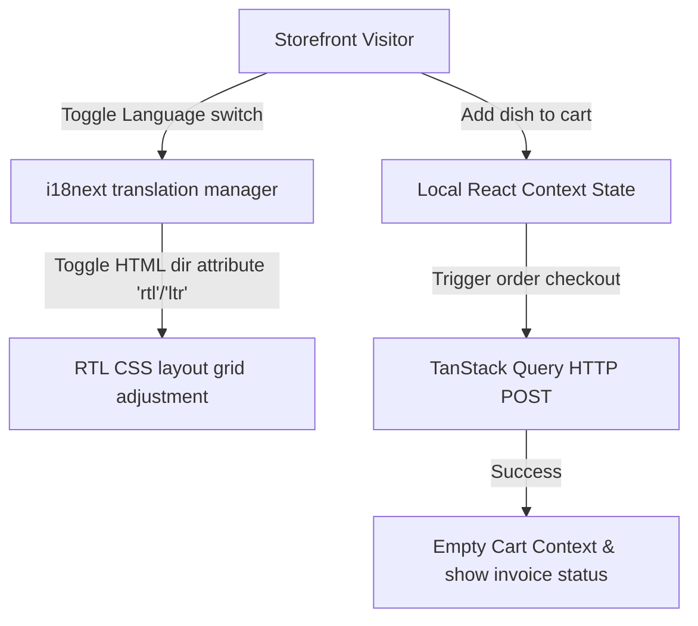

# Damascus Restaurant Hub: Bilingual Order System & RTL Sync Layout

<div align="center">
  
</div>

<div align="center">
     
</div>

واجهة **مطعم بوابات الشام** هي منصة تفاعلية سريعة تتيح للمستخدمين تصفح قائمة الوجبات السورية وحجز الطلبات بلغات متعددة (عربي/إنجليزي) مع دعم متكامل ومباشر لتنسيق RTL العربي ومزامنة حالة سلة المشتريات.

This repository holds the React frontend storefront and ordering client for the **Damascus Restaurant Portal**. It features state-of-the-art multilingual layout transitions and full RTL rendering persistence.

---

## 🧬 Translation & Ordering State Flow

The application coordinates translation keys and syncs menu items caching:



---

## 🧬 Key Frontend Features

1.  **RTL/LTR Layout Sync**: Dynamic HTML direction wrapper mapping CSS Grid and typography styles.
2.  **TanStack Query Cache**: Fast item query cache prevents server fetching loops when navigating menu sections.
3.  **Interactive Booking Wizard**: Simple interactive checkout wizard managing guest forms and food selections.

---

## 🛠️ Technology Stack & Styling Assets

*   **Framework**: **React 18** + **Vite** for high performance.
*   **State Management**: **TanStack Query** (React Query) + local Context API.
*   **Localization**: **i18next** translation package.
*   **Design**: HSL customized design systems supporting responsive layouts.

---

## 📂 Repository Module Layout

```text
damascus-restaurant/
├── src/
│   ├── components/      # Menu cards, Cart drawers, Order modals
│   ├── locales/         # i18n English & Arabic translation sheets
│   ├── context/         # React Cart Context state handlers
│   ├── App.jsx          # Storefront layout controller
│   └── main.jsx         # Render entry point
├── package.json         # Node metadata
└── README.md            # System documentation
```

---

## ⚡ Local Setup & Run
```bash
git clone https://github.com/Sayed-Herzallah/damascus-restaurant.git
cd damascus-restaurant
npm install
npm run dev
```

---

## 📄 License
Licensed under the **MIT License**.
